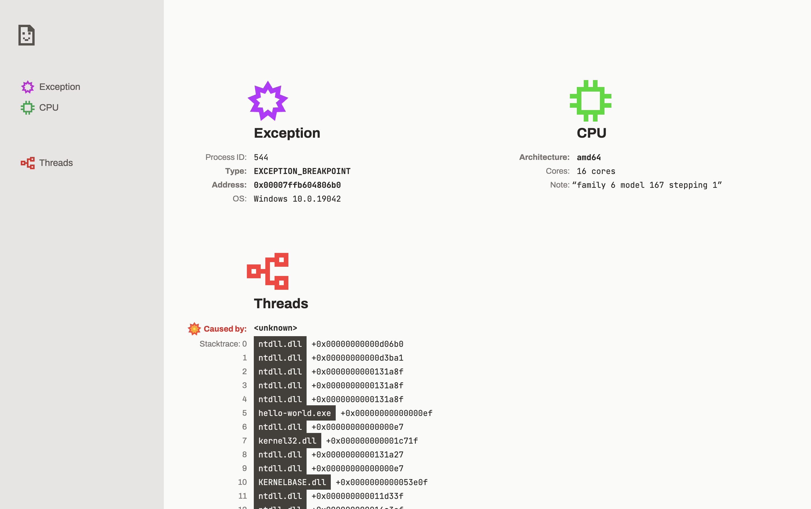

<center>


_Hiya, I'm **Dumpy**._

_I'm the crash assistant and my job is to help you with your (crash) dumps._

✧･ﾟ: \* ✦ . ･ﾟ

</center>

# 📄 Dumpy

Dumpy is a Web application that digests dumps from applications that have either 💥 crashed 🔥 or simply decided to take a dump. ✨ These dumps contain a trove of data about the running (or not running) state of an application, such as:

- The address of a malformed instruction or incorrect memory read
- Call stack traces
- Information about the processor and its registers
- Sometimes an associated error message and other more gifts

Dumpy formats and displays all this information in an interactive and purpose-built interface. Whether you need to skim the important bits quickly or dive deep into a dump, Dumpy can help you with your dumps. 😊



## Tell Me More...

### 🚧 Work in Progress

First and foremost, Dumpy is not a completed project. Much of Dumpy's potential is still to be realized. Still, Dumpy is already helpful enough to

### 🕸️ Local Dump Parsing

When you give a precious dump to Dumpy, that dump isn't uploaded anywhere. Dumpy is powerful enough to parse and analyze your dump on your own machine. Dump parsing is powered by a WebAssembly module written in Rust.

Currently, the only dump format supported is the minidump format, used by Google Chrome/Chromium, Firefox, and Windows, among others. In particular, the library Dumpy uses to process minidump files supports the dumps produced by the `MinidumpWriteDump` API on Windows as well as the Google Breakpad library.[^1]

[^1]: Supported formats according to the [minidump crate](https://docs.rs/minidump/latest/minidump/) as of 2023 April 16.

### 📝 To-do

- [x] **Demo**: produce a GitHub Pages demo branch
- [ ] **Symbols**: the names and other source information that helps enrich a dump
  - [ ] **Symbolication**: the process of enriching a dump using symbols
  - [ ] **Symbol Servers**: ability to specify servers to fetch symbols from
  - [ ] **Local Symbols**: ability to use local symbol files
  - [ ] **Custom Symbol Proxy**: a symbol proxy to let the web app retrieve symbols from servers that don't include an appropriate Content Security Policy header.
    - This symbol proxy should be able to run locally as well as deployed.
- [ ] **Modules**: a view for the modules in a dump
- [ ] **Sidebar**: it would be nice for the sidebar to actually do something :) but at least it looks pretty.
- [ ] **Dark theme**: your eyes are important.

## How Do I Use It?

If you need a [**sample file** to test with][sample-dmp], I've included one in this repo! 😊 I have 'borrowed' this dump from the [rust-minidump project's test files](https://github.com/rust-minidump/rust-minidump/blob/main/testdata/full-dump.dmp).

[sample-dmp]: ./meta/sample-full.dmp

### 🌐 Web

You can [try the online demo](https://clavin.github.io/Dumpy/). If you need one, you can use [this sample dump file][sample-dmp].

### 💻 Locally

What you'll need:

- A recent version of Node.js, I'd ballpark it to be version 16+
  - NPM, which generally comes with Node.js
- [wasm-pack](https://rustwasm.github.io/wasm-pack/) to build the dump processor

0. Grab your copy of this repository

   ```sh
   $ git clone https://github.com/clavin/Dumpy.git
   $ cd Dumpy
   ```

1. Install the project build dependencies

   ```sh
   $ npm install
   ```

2. Build the dump processor crate

  ```sh
  $ cd crate
  $ wasm-pack build

  $ cd ..
  ```

3. Build the web app

   ```sh
   $ npm run build

   # (If you need to specify any additional Vite options, like `--base`, this is
   # the place to do it.)
   ```

4. Enjoy! The web app is available in the `dist/` directory. 🎉

- Alternatively, if you're looking to hack on Dumpy, I would recommend using the `npm run dev` command for an ergonomic web development workflow.

## 🏆 Credits & Kudos

- Underlying technologies:
  - [Svelte](https://svelte.dev/)
  - [Vite](https://vitejs.dev/)
  - [Tailwind CSS](https://tailwindcss.com/)
  - [WebAssembly](https://webassembly.org/)
  - [Rust](https://www.rust-lang.org/)
  - [rust-minidump](https://github.com/rust-minidump/rust-minidump)
- Kudos:
  - [@nornagon](https://github.com/nornagon) for suggesting this idea and pointing me in the right direction.
  - [@Gankra](https://github.com/Gankra) for their work on [rust-minidump](https://github.com/rust-minidump/rust-minidump), namely a relatively large refactor to get [symbolication to work async](https://github.com/rust-minidump/rust-minidump/pull/329).
  - [Svelte Hack](https://hack.sveltesociety.dev/), the hackathon I submitted this project to, for giving me the drive and pleasant framework to make this project real.
  - My partner for his words of encouragement and eye for design that helped me get this project across the (MVP) finish line. 🏁
